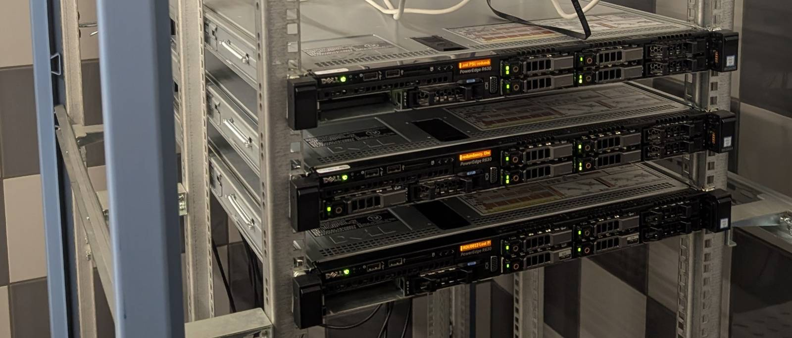

# Hi there 👋

## My work

Our rack at WMS_DEV

At WMS_DEV we've picked up one node and started a server room around June 2024, then two more in 2025.

Since then I've spent a lot of time migrating our infrastructure from an old VPS to new hardware. We’ve built most of it from the ground up, since the previous Docker-based setup had significant limitations.

We went through a few iterations to get where we are now, and it’s still evolving.

Currently:

- 3-node Proxmox cluster
- 2 Kubernetes clusters (platform + apps)
- ~20 services (observability, CI/CD, secrets, etc.)

A big part of the work was also redesigning and hardening containers and writing Helm charts for proper Kubernetes deployments.

---

## About me

I currently work on DevOps and infrastructure at [@WMS-DEV](https://github.com/WMS-DEV) alongside my studies.

I started with web development (Python, Java, some Rust), but these days I mostly focus on infrastructure, Kubernetes and automation. I also run a homelab and use Linux as my daily driver.

I still enjoy some lighter web-design work on the side.

Outside of tech I like hiking and am a speedway fan. I also used to play guitar and drums.

## Education

- **(2019 - 2023)** Academic High School of Wroclaw University of Science and Technology
- **(2023 - current)** Cybersecurity in Information Systems student at Wroclaw University of Science and Technology

---

  

